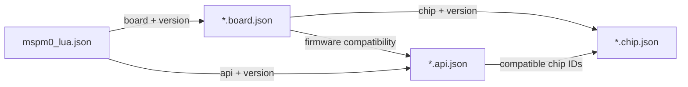

# MCU / 开发板 / 固件 API 元数据标准

模块化固件 catalog、原生模块推导和两阶段运行事务见
[`../modular-run.md`](../modular-run.md)。Chip/Board/API 三层元数据仍按本文规则
管理；模块化运行会额外校验固件发布中的完整 API 和 catalog 身份。

状态：Draft v1.0.0

本标准用于替代 IDE 中硬编码的 MCU 引脚、开发板引出资源和 Lua 固件 API。文件使用 UTF-8 JSON，不允许注释；说明文字、来源和扩展信息必须写入标准字段。三个核心文件分别由 JSON Schema 校验：

- `*.chip.json`：某一 MCU 型号及封装的完整引脚和复用能力。
- `*.board.json`：某一开发板版本、实际引出引脚、板载占用和字节码存储位置。
- `*.api.json`：某一固件 ABI 暴露的全局函数、模块、类型、参数语义和资源副作用。

Schema 位于 `schemas/`，非权威的最小示例位于 `examples/`。示例只演示结构，不能作为芯片手册或固件绑定表使用。

## 1. 标识与文件布局

推荐注册表布局：

```text
metadata/
  chips/<vendor>/<id>.chip.json
  boards/<vendor>/<id>.board.json
  apis/<firmware>/<id>.api.json
```

所有文件必须包含：

- `schema_version`：元数据格式版本，当前为 `1.0.0`。
- `kind`：`chip`、`board` 或 `api`。
- `id`：全注册表唯一、稳定、全小写的点分 ID。
- `version`：内容版本，使用 SemVer。事实或绑定变化必须提升版本。
- `quality`：数据覆盖度和审核状态。用于正式诊断的芯片文件必须为 `coverage: complete`。
- `provenance`：数据来源、文档版本、许可证和校验时间。不得直接复制不具备许可的厂商图表或第三方私有数据库。

ID 一经发布不得改变含义。显示名称、翻译和文件路径可以变化，跨文件引用只能使用 ID 与版本约束，不能使用显示名称。

工程文件中的 `board_version` 与 `api_version` 是精确版本，IDE 不得静默升级。Board 内的 `chip_ref.version` 才允许使用 SemVer 范围；注册表有多个满足版本时选择最高版本，同一 ID + version 出现两份文件则拒绝加载。

## 2. 引用链

工程只需选择开发板和固件 API；开发板决定芯片及封装：



建议把现有工程文件扩展为：

```json
{
  "name": "I2C demo",
  "main_source": "main.lua",
  "target_luac": "main.luac",
  "target": {
    "board": "ti.launchpad-mspm0g3507.rev-a",
    "board_version": "1.0.0",
    "api": "mspm0.lua-bytecode",
    "api_version": "0.2.0"
  }
}
```

旧工程没有 `target` 时只能进入兼容模式：IDE 可使用内置默认配置，但必须显示“目标未锁定”，不能给出确定性的引脚合法结论。

## 3. Chip 文件

一个 Chip 文件描述一个明确的“型号 + 封装”。同一裸片的 LQFP 与 QFN 必须是不同 ID，避免封装脚位和未引出 GPIO 混淆。

### 3.1 引脚

`pins[].id` 是代码中使用的规范名称，例如 `PA15`。`package_positions` 是物理封装脚位，仅用于文档和板级校验。每个引脚包含一个或多个 `capabilities`：

- `function`：数据手册中的规范复用名称，例如 `I2C1_SCL`。
- `class`：跨厂商归一化类别，例如 `gpio`、`i2c`、`spi`、`uart`、`pwm`、`adc`。
- `peripheral`：外设实例 ID，例如 `I2C1`。
- `signal`：实例内信号，例如 `SCL`。
- `route`：同一组合法路由的稳定 ID。SCL 与 SDA 只有 `peripheral` 和 `route` 同时相同才构成合法组合。
- `selector`：可选的厂商 MUX 编码，仅供代码生成或底层工具使用。

只按 `class` 和 `signal` 过滤是不够的；补全器必须同时解析 `peripheral` 与 `route`，否则可能组合出分别合法但无法同时工作的两根引脚。

### 3.2 外设

`peripherals` 声明芯片实际拥有的实例和信号集合。引脚能力引用的 `peripheral` 必须存在，`signal` 必须属于该实例。芯片级互斥、调试口、启动脚和电气限制写入 `constraints`，不能放进 IDE 源码。

## 4. Board 文件

Board 文件是 IDE 向用户提供引脚候选的边界。代码补全默认只能返回 `pins[]` 中 `available: true` 的项目，不能返回 Chip 文件中的全部引脚。

### 4.1 引出引脚

`pins[]` 同时保存板级名称和芯片引脚：

- `id`：稳定板级 ID，例如 `J1.7`。
- `name`：丝印或首选显示名。
- `aliases`：用户可能输入的别名。
- `chip_pin`：必须引用 Chip 文件中的 `pins[].id`。
- `available`：是否允许普通应用使用。
- `allow_classes` / `deny_functions`：板级能力收窄，绝不能扩大芯片能力。
- `preference`：多个合法候选的排序权重，不影响合法性。

### 4.2 板载占用

`onboard_devices[].connections` 描述 LED、调试器、USB-UART、传感器和外置 Flash 等固定连线。`exclusive: true` 表示默认从普通补全中排除；`releasable: true` 表示可以在用户显式选择后使用，但应给出警告。

`reserved_pins` 描述 BOOT、SWD、晶振等非设备型限制。`severity: error` 的引脚不能被普通 API 建议；`warning` 可显示但应排在最后并解释风险。

### 4.3 Lua 字节码位置

存储不能用单个 `has_flash` 布尔值表达。Board 文件使用：

- `memory_devices`：内部 Flash、外置 SPI NOR、EEPROM、主机文件等实际存储。
- `artifact_targets`：逻辑产物到存储的映射。

IDE 查找 `kind: lua_bytecode` 的目标，根据 `storage`、`base_path`、`filename_template`、`upload_strategy` 和 `max_bytes` 决定 `.luac` 的编译输出、上传命令和运行路径。换板或更换外置 Flash 时只修改 Board 文件。

## 5. API 文件

API 文件是补全的第一事实来源。`globals` 与 `modules[].functions` 构成允许调用的函数全集；不在 API 文件中的函数必须被标记为未知，即使其他 MCU 或旧固件曾经支持。

每个函数提供一个或多个 `overloads`。参数顺序、类型、默认值、补全文字和资源约束全部位于重载中。

### 5.1 资源参数与语义绑定

引脚、外设实例、板载设备和存储位置通过 `resource` 描述，而不是靠参数名猜测。核心字段：

- `kind`：`pin`、`peripheral`、`device` 或 `storage`。
- `scope`：引脚通常必须为 `board.exposed`。
- `capability`：要求的 `class`、`signal` 或精确 `function`。
- `bindings`：把候选资源的属性绑定到语义槽位。

例如 I2C 的 bus、SCL 和 SDA 都把外设实例绑定到 `i2c_instance`，两根引脚还把路由绑定到 `i2c_route`。同名槽位必须相等：

```json
{
  "name": "scl",
  "type": "pin",
  "resource": {
    "kind": "pin",
    "scope": "board.exposed",
    "capability": { "class": "i2c", "signal": "SCL" },
    "bindings": {
      "peripheral": "i2c_instance",
      "route": "i2c_route"
    }
  }
}
```

这种结构让补全和错误检查调用同一个资源求解器：已填写的实参先产生绑定，未填写参数的候选再按绑定过滤。

### 5.2 关系与副作用

- `relations` 表达参数间的 `distinct`、`same_value`、`less_or_equal` 等结构化关系。
- `effects` 表达 API 对资源的 `claim`、`release`、`read`、`write`。静态分析可发现同一引脚被 UART 与 PWM 同时占用。
- `availability` 表达固件 feature、芯片或版本条件。
- `deprecated` 保留迁移信息；删除 API 必须提升 API 文件主版本。

规则必须使用 Schema 定义的结构化字段，禁止加入需要 `eval` 的表达式字符串。

## 6. 统一解析与补全流程

IDE 打开工程时按以下顺序构建不可变的 `TargetProfile`：

1. 用对应 Schema 分别校验三份 JSON；任何未知字段、重复 ID 或类型错误都阻止加载。
2. 解析 Project -> Board -> Chip 和 Project -> API 引用，检查版本与兼容列表。
3. 校验 Board 的每个 `chip_pin`、板载连接和存储引用均存在。
4. 校验 API 中每个资源类别、信号和精确函数可由兼容 Chip 提供。
5. 生成 `board_pin -> chip capabilities` 索引，并应用 `available`、板载独占、保留脚和能力收窄。
6. 以 API 文件建立全局函数、模块成员、类型和重载索引。
7. 对每个调用点先匹配 API 重载，再把已知实参写入语义绑定，最后为当前参数求解候选。

候选排序建议：

1. 合法且未占用的开发板引出脚。
2. `preference` 较高、丝印名称匹配或已形成完整 route 的引脚。
3. `warning` 或 `releasable` 资源，仅在普通候选之后显示并带诊断说明。
4. Chip 存在但开发板未引出的引脚不得显示。

## 7. 统一诊断流程

诊断必须复用补全产生的 `TargetProfile` 和资源求解器：

- `API001`：函数或模块不在当前 API 文件。
- `API002`：没有匹配的重载或参数类型错误。
- `PIN001`：引脚不存在于 Chip 文件。
- `PIN002`：芯片有该引脚，但开发板未引出或 `available: false`。
- `PIN003`：引脚不支持 API 参数要求的功能/信号。
- `PIN004`：多个引脚的 peripheral 或 route 绑定不一致。
- `PIN005`：引脚被板载设备或前序 API 调用独占。
- `BOARD001`：板级保留脚风险。
- `STORE001`：开发板没有可用的 `lua_bytecode` 产物目标。
- `META001`：三文件引用、版本或完整性校验失败。

诊断文本可以本地化，但错误码和触发条件必须稳定，便于测试和外部工具消费。

## 8. 版本与缓存

- Schema 的主版本不兼容；IDE 必须拒绝未知主版本。
- 内容文件版本独立于 Schema 版本。
- Registry 更新必须原子替换；加载成功后才能切换当前 Profile。
- 缓存键应包含三个文件的规范化 SHA-256、IDE 求解器版本和工程 target。
- 文件变更后重新加载；失败时保留上一个有效 Profile，但明确显示元数据错误，不能静默使用部分新数据。

## 9. 扩展原则

每个主要对象都提供 `extensions` 容器。厂商或实验性字段只能放在 `extensions` 中，键应使用反向域名，例如 `com.example.drive_strength_code`。核心解析器忽略未知扩展，但不得忽略核心对象中的拼写错误；因此 Schema 对核心对象统一使用 `additionalProperties: false`。

## 10. 来源、版权与专利边界

- `provenance.sources` 和 `provenance.license` 必填；正式数据还应记录文档修订号、获取日期和 SHA-256。
- 只录入为实现互操作所需的硬件事实与 API 签名，不复制厂商手册的图、表版式、说明文字或第三方私有数据库。
- 元数据作者只能给自己生成的 JSON 选择许可证，不能借此重新许可芯片手册、固件或商标；产品名称仅用于准确识别兼容目标。
- Schema 和资源求解模型是本项目的独立实现，不依赖 VOFA+ 或其他串口工具的代码、资源文件、协议私有实现或界面素材。
- `provenance` 不是专利许可。发布面向特定地区或商业产品的数据包前，应由权利人或法律人员另做专利与商标审查；IDE 不宣称不存在第三方专利。

## 11. IDE 加载门槛

IDE 必须按原子事务加载 Profile：Schema 校验、版本解析和所有语义校验全部成功后才替换当前 Profile。至少检查：

1. 所有集合内 ID 唯一，所有 Board 引脚、板载连接、存储和 artifact 引用存在。
2. Chip capability 引用的 peripheral/signal 存在，组合信号的 `route` 可闭合。
3. API compatibility 同时允许当前 Chip 与 Board，API 资源需求可由当前目标满足。
4. `lua_bytecode` artifact target 存在并指向可写存储。
5. 目标锁定但加载失败时禁用目标相关补全，禁止退回另一块板的硬编码引脚表。

补全和诊断必须调用同一个资源求解器。IDE 先匹配 API 重载，再把已输入参数的 `bindings` 写入约束集，最后求当前参数候选；诊断则对完整实参执行同一过程并返回稳定错误码。
